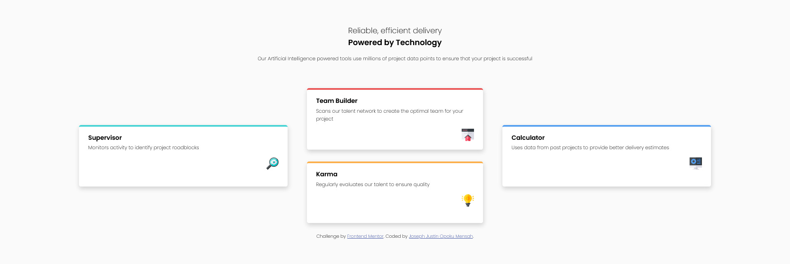

# Frontend Mentor - Four card feature section solution

This is a solution to the [Four card feature section challenge on Frontend Mentor](https://www.frontendmentor.io/challenges/four-card-feature-section-weK1eFYK). Frontend Mentor challenges help you improve your coding skills by building realistic projects.

## Table of contents

- [Overview](#overview)
  - [The challenge](#the-challenge)
  - [Screenshot](#screenshot)
  - [Links](#links)
- [My process](#my-process)
  - [Built with](#built-with)
  - [What I learned](#what-i-learned)
  - [Continued development](#continued-development)
- [Author](#author)
- [Acknowledgments](#acknowledgments)

## Overview

### The challenge

Users should be able to:

- View the optimal layout for the site depending on their device's screen size

### Screenshot

### Links

- Solution URL: [Github Repo](https://github.com/JustinJoe/four-card-feature-section)
- Live Site URL: [Four Card Feature Section](https://four-card-feature-section-justinjoe.vercel.app/)

## My process

### Built with

- Semantic HTML5 markup
- CSS custom properties
- Flexbox
- Mobile-first workflow

### What I learned

Improved my thought process on structuring HTML to help write CSS faster and easier

### Continued development

## Author

- Github - [Joseph Justin Opoku Mensah](https://github.com/JustinJoe)
- Frontend Mentor - [@JustinJoe](https://www.frontendmentor.io/profile/JustinJoe)
- Twitter - [@justinjoe6](https://www.twitter.com/justinjoe6)

## Acknowledgments

Thanks to Frontend Mentor for providing this challenge for free!
